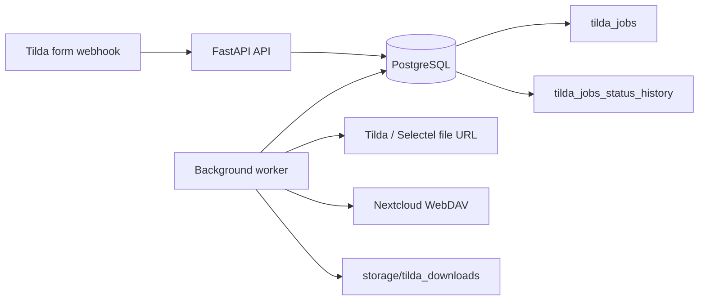

# Integration Layer Tilda API

<p align="center">
	
	
	
	
	
</p>

<p align="center">
	Integration-сервис между Tilda и Nextcloud: принимает webhook'и, складывает задания в PostgreSQL, скачивает архивы и загружает их в WebDAV-хранилище.
</p>

## Обзор

`integration_layer_tilda_api` решает одну узкую прикладную задачу: безопасно принять webhook из Tilda, отложенно обработать файл из формы и сохранить его в Nextcloud, не заставляя Tilda ждать длительную загрузку и обработку.

Сервис разделён на два независимых runtime-процесса на одной кодовой базе:

- `api`: принимает webhook и сохраняет задачу в PostgreSQL;
- `worker`: забирает готовую задачу, скачивает архив, валидирует его и загружает в Nextcloud по WebDAV.

Такое разделение делает приём webhook'ов быстрым и идемпотентным, а тяжёлую обработку файлов переводит в фоновую очередь.

## Что делает сервис

- Принимает `x-www-form-urlencoded` webhook от Tilda.
- Поддерживает optional webhook API key через header или POST-поле.
- Выделяет из payload `tranid`, `formid` и ссылку на архив.
- Создаёт задачу в PostgreSQL со статусом `queued`.
- Не создаёт дубликаты при повторной доставке одного и того же `tranid`.
- Worker забирает следующую готовую задачу с lease-lock через БД.
- Скачивает только поддерживаемые архивы и валидирует их реальное содержимое.
- Повторяет только временные ошибки, а необратимые сразу помечает как `failed`.
- Загружает итоговый файл в Nextcloud и сохраняет `stored_file_name` в БД.
- Пишет историю смены статусов в отдельную таблицу.

## Архитектура



## Основной сценарий работы

1. Tilda отправляет webhook на `POST /api/v1/webhooks/tilda`.
2. API парсит form payload, при необходимости проверяет API key и извлекает ссылку на файл.
3. Если это test-webhook (`test=test`), сервис сразу отвечает `ok` без записи задачи в БД.
4. Для обычного webhook'а сервис создаёт запись в `tilda_jobs` со статусом `queued`.
5. Если `tranid` уже существует, новая задача не создаётся: webhook считается дубликатом.
6. Worker атомарно claim'ит следующую готовую задачу и ставит ей статус `processing`.
7. Worker скачивает архив, проверяет размер, расширение и сигнатуру файла.
8. При успехе файл загружается в Nextcloud, а задача получает статус `done`.
9. При временной ошибке задача уходит в `retry_wait` до `next_retry_at`.
10. При необратимой ошибке или после исчерпания попыток задача получает статус `failed`.

## Статусы задач

| Статус | Назначение |
| --- | --- |
| `queued` | новая задача, ожидающая обработки |
| `processing` | задача захвачена worker'ом и находится в работе |
| `done` | архив успешно скачан и загружен в Nextcloud |
| `failed` | задача завершилась необратимой ошибкой или исчерпала лимит попыток |
| `retry_wait` | временная ошибка, задача вернётся в обработку после `next_retry_at` |

Дополнительно сервис хранит историю переходов в `tilda_jobs_status_history`.

## Что считается временной, а что окончательной ошибкой

### Уходят в `retry_wait`

- файл в Tilda/Selectel ещё не готов и storage возвращает HTML-заглушку;
- сетевые ошибки `URLError` и timeout;
- HTTP `408`, `429`, `500`, `502`, `503`, `504`;
- ошибки создания каталога или upload в Nextcloud.

### Сразу уходят в `failed`

- неподдерживаемая схема URL;
- неподдерживаемое расширение файла;
- пустой файл;
- файл больше разрешённого лимита;
- несовпадение сигнатуры архива с расширением;
- ошибочная конфигурация Nextcloud или невалидные креды.

## Особенности webhook-парсинга

Сервис ждёт `application/x-www-form-urlencoded`, а не JSON.

Обязательные поля обычного webhook:

- `tranid`
- `formid`
- ссылка на файл, которая обычно приходит в одном из полей:
  - `Прикрепите_файлы`
  - `Прикрепите_файл_архив_с_документами`

Если прямого совпадения нет, сервис ищет первое URL-значение в поле, название которого похоже на upload/file/archive/document.

## Идемпотентность и очередь

Сервис не делает повторных задач на один и тот же `tranid`.

Технически это реализовано так:

- в `tilda_jobs.tran_id` есть уникальность;
- вставка идёт через `INSERT ... ON CONFLICT DO NOTHING`;
- при конфликте API получает уже существующую задачу и завершает запрос без ошибки;
- worker использует `FOR UPDATE SKIP LOCKED`, `locked_until` и `locked_by`, чтобы безопасно брать задания из очереди.

Это позволяет переживать повторную доставку webhook'ов и запускать больше одного worker-процесса на одной БД без гонок за одну и ту же задачу.

## Ограничения на файлы

По умолчанию worker принимает только:

- `.zip`
- `.rar`

Проверка идёт в два этапа:

1. по расширению и размеру;
2. по реальной сигнатуре содержимого.

Для `.zip` используется `zipfile.is_zipfile`, для `.rar` - проверка RAR4/RAR5 magic bytes.

Если remote storage возвращает HTML вместо архива, сервис отличает ситуацию "файл ещё не готов" от "пришла не та страница" и выбирает `retry_wait` или `failed` соответственно.

## Хранение в Nextcloud

Upload идёт через WebDAV в каталог `NEXTCLOUD_REMOTE_DIR`.

Итоговое имя файла для обработанной задачи формируется как:

```text
tilda_job_<job_id>.<ext>
```

Если указан `NEXTCLOUD_PUBLIC_BASE_URL`, сервис дополнительно собирает публичный URL файла.

## Стек

| Слой | Технологии |
| --- | --- |
| API | FastAPI, Uvicorn |
| Конфиг | Pydantic Settings |
| База данных | PostgreSQL, SQLAlchemy 2, SQLModel, asyncpg |
| Миграции | Alembic |
| Логи | Loguru |
| Контейнеризация | Docker, Docker Compose |
| Интеграции | Tilda webhook, Nextcloud WebDAV |

## Требования

- Python `3.12`
- Poetry
- Docker и Docker Compose
- доступный PostgreSQL
- доступный Nextcloud с WebDAV и app password

## Быстрый старт

### Вариант 1. Локальный запуск

1. Установите зависимости:

```bash
poetry install
```

2. Поднимите PostgreSQL:

```bash
docker compose up -d db
```

3. Создайте `.env` и заполните минимум:

```env
POSTGRES_HOST=localhost
POSTGRES_PORT=5432
POSTGRES_USER=tilda_api
POSTGRES_PASSWORD=tilda_api
POSTGRES_DATABASE=tilda_api

NEXTCLOUD_BASE_URL=https://nextcloud.example.com
NEXTCLOUD_USERNAME=your-user
NEXTCLOUD_APP_PASSWORD=your-app-password
NEXTCLOUD_REMOTE_DIR=tilda

FILE_DOWNLOADER_DIR=storage/tilda_downloads
FILE_DOWNLOADER_MAX_SIZE_MB=25
FILE_DOWNLOADER_ALLOWED_EXTENSIONS=zip,rar

WORKER_ID=tilda-worker
WORKER_POLL_INTERVAL_SECONDS=5
WORKER_RETRY_DELAY_SECONDS=300
WORKER_LOCK_SECONDS=300
WORKER_MAX_ATTEMPTS=10
```

4. Примените миграции:

```bash
poetry run alembic upgrade head
```

5. Запустите API:

```bash
poetry run python -m api.app
```

6. Во втором терминале запустите worker:

```bash
poetry run python -m worker.main
```

После запуска будут доступны:

- API: `http://localhost:8000`
- healthcheck: `http://localhost:8000/health`
- OpenAPI: `http://localhost:8000/docs`

### Вариант 2. Docker Compose

В репозитории уже есть единый образ для `api` и `worker`.

Первый запуск:

```bash
docker compose build --no-cache
docker compose up -d db
docker compose --profile ops run --rm migrate
docker compose up -d api worker
```

Основные сервисы compose-стека:

| Сервис | Назначение |
| --- | --- |
| `db` | PostgreSQL |
| `migrate` | one-shot контейнер с `alembic upgrade head` |
| `api` | FastAPI приложение |
| `worker` | background worker |

## Переменные окружения

Конфигурация читается из `.env`.

### `APP_*`

| Переменная | Значение по умолчанию | Назначение |
| --- | --- | --- |
| `APP_NAME` | `API_tilda` | имя приложения |
| `APP_HOST` | `0.0.0.0` | bind host API |
| `APP_PORT` | `8000` | порт API |
| `APP_DEBUG` | `False` | debug mode |
| `APP_LOG_LEVEL` | `INFO` | уровень логирования |
| `APP_API_PREFIX` | `/api/v1` | префикс API |
| `APP_DB_SCHEMA` | `integration_tilda` | схема БД |

### `POSTGRES_*`

| Переменная | Значение по умолчанию |
| --- | --- |
| `POSTGRES_HOST` | `localhost` |
| `POSTGRES_PORT` | `5432` |
| `POSTGRES_USER` | `tilda_api` |
| `POSTGRES_PASSWORD` | `tilda_api` |
| `POSTGRES_DATABASE` | `tilda_api` |
| `POSTGRES_ECHO` | `True` |
| `POSTGRES_POOL_SIZE` | `5` |
| `POSTGRES_MAX_OVERFLOW` | `15` |

### `WEBHOOK_*`

| Переменная | Значение по умолчанию | Назначение |
| --- | --- | --- |
| `WEBHOOK_API_KEY_TRANSPORT` | `header` | где ждать API key: `header` или `post` |
| `WEBHOOK_API_KEY_NAME` | `X-Tilda-Webhook-Key` | имя заголовка или POST-поля |
| `WEBHOOK_API_KEY` | пусто | ожидаемое значение ключа |

Если `WEBHOOK_API_KEY` пустой, проверка webhook key отключена.

### `NEXTCLOUD_*`

| Переменная | Значение по умолчанию | Назначение |
| --- | --- | --- |
| `NEXTCLOUD_BASE_URL` | пусто | базовый URL Nextcloud |
| `NEXTCLOUD_USERNAME` | пусто | пользователь Nextcloud |
| `NEXTCLOUD_APP_PASSWORD` | пусто | app password |
| `NEXTCLOUD_DAV_USER_ID` | `NEXTCLOUD_USERNAME` | user id для WebDAV |
| `NEXTCLOUD_REMOTE_DIR` | `tilda` | каталог загрузки |
| `NEXTCLOUD_PUBLIC_BASE_URL` | `None` | публичный base URL для ссылок |
| `NEXTCLOUD_TIMEOUT_SECONDS` | `30` | timeout WebDAV |

### `FILE_DOWNLOADER_*`

| Переменная | Значение по умолчанию | Назначение |
| --- | --- | --- |
| `FILE_DOWNLOADER_DIR` | `storage/tilda_downloads` | временная директория файлов |
| `FILE_DOWNLOADER_MAX_SIZE_MB` | `25` | лимит размера |
| `FILE_DOWNLOADER_ALLOWED_EXTENSIONS` | `zip,rar` | whitelist расширений |

### `WORKER_*`

| Переменная | Значение по умолчанию | Назначение |
| --- | --- | --- |
| `WORKER_ID` | `tilda-worker` | идентификатор worker-инстанса |
| `WORKER_POLL_INTERVAL_SECONDS` | `5` | интервал опроса очереди |
| `WORKER_ERROR_BACKOFF_SECONDS` | `10` | пауза после неожиданных ошибок |
| `WORKER_LOCK_SECONDS` | `300` | lease-lock на задачу |
| `WORKER_RETRY_DELAY_SECONDS` | `300` | пауза перед повтором |
| `WORKER_MAX_ATTEMPTS` | `10` | лимит попыток |
| `WORKER_SHUTDOWN_GRACE_SECONDS` | `30` | graceful shutdown timeout |

## API endpoint'ы

| Метод | Путь | Назначение |
| --- | --- | --- |
| `GET` | `/health` | liveness-check API процесса |
| `POST` | `/api/v1/webhooks/tilda` | приём webhook'а из Tilda |

Ответ webhook endpoint'а - plain text `ok`.

Это важно:

- test-request тоже отвечает `ok`;
- duplicate webhook тоже фактически завершается `ok`;
- API не ждёт окончания скачивания и загрузки файла.

## Пример webhook-запроса

Пример с API key в header:

```bash
curl -X POST http://localhost:8000/api/v1/webhooks/tilda \
  -H "Content-Type: application/x-www-form-urlencoded" \
  -H "X-Tilda-Webhook-Key: secret-key" \
  --data-urlencode "tranid=abc123" \
  --data-urlencode "formid=form_01" \
  --data-urlencode "Прикрепите_файлы=https://example.com/file.zip"
```

Пример test-webhook:

```bash
curl -X POST http://localhost:8000/api/v1/webhooks/tilda \
  -H "Content-Type: application/x-www-form-urlencoded" \
  --data-urlencode "test=test"
```

## Структура проекта

```text
api/
	app.py                     # FastAPI application и healthcheck
	routers/v1/               # webhook router, payload parsing и auth helpers
application/
	accept_tilda_webhook.py   # use case создания задачи
	process_next_tilda_job.py # use case обработки следующей задачи
	constants/                # enum статусов задач
	mappers/                  # классификация processing errors
infrastructure/
	database/                 # provider, модели, репозитории
	downloader/               # скачивание, source resolving, content validation
	uploader/                 # Nextcloud WebDAV upload helpers
	file_downloader.py        # публичный re-export downloader
	nextcloud_file_storage.py # публичный re-export storage
setting/
	config.py                 # env-based configuration
	logging.py                # логирование
worker/
	main.py                   # polling worker loop
alembic/                   # миграции БД
docker-compose.yml         # db + migrate + api + worker
Dockerfile                 # единый image для api и worker
```

## Полезные команды

```bash
poetry install
poetry run alembic upgrade head
poetry run python -m api.app
poetry run python -m worker.main
poetry run ruff check .
poetry run python -m mypy .
docker compose up -d db
docker compose --profile ops run --rm migrate
docker compose up -d api worker
```

## Операционные заметки

- временные скачанные файлы хранятся в `storage/tilda_downloads` и удаляются после обработки;
- worker корректно останавливается по `SIGINT`/`SIGTERM`;
- зависшие задачи возвращаются в обработку после истечения `locked_until`;
- если нужен более высокий throughput, можно запускать несколько worker'ов на одной БД;
- сейчас в репозитории нет готового `.env.example`, поэтому README фактически играет роль стартовой документации по конфигу.

## Связанные данные в БД

Ключевые поля таблицы `tilda_jobs`:

- `tran_id` - внешний id отправки из Tilda;
- `form_id` - id формы;
- `payload` - полный очищенный payload webhook'а в JSONB;
- `file_url` - прямой URL архива;
- `tilda_jobs_status_id` - текущий статус;
- `attempt_count`, `last_error_message`, `next_retry_at` - служебные поля обработки;
- `stored_file_name` - имя файла после успешной загрузки.

## Что можно улучшить дальше

- добавить `.env.example`, чтобы onboarding стал полностью самодостаточным;
- вынести metrics/observability по очереди и ошибкам;
- добавить endpoint или admin-view для просмотра состояния задач;
- покрыть use case'ы тестами на duplicate webhook, retry и content validation.
